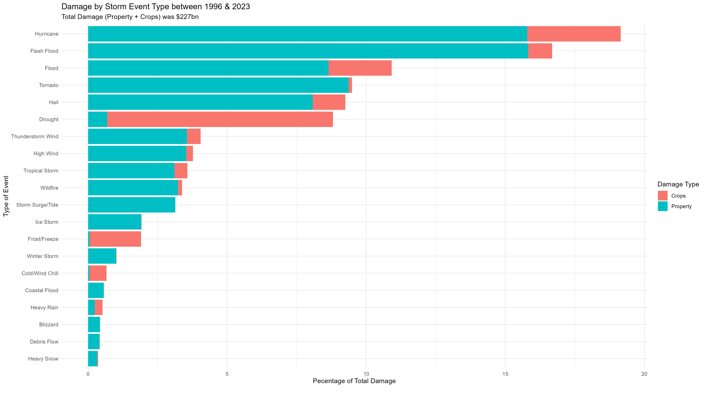
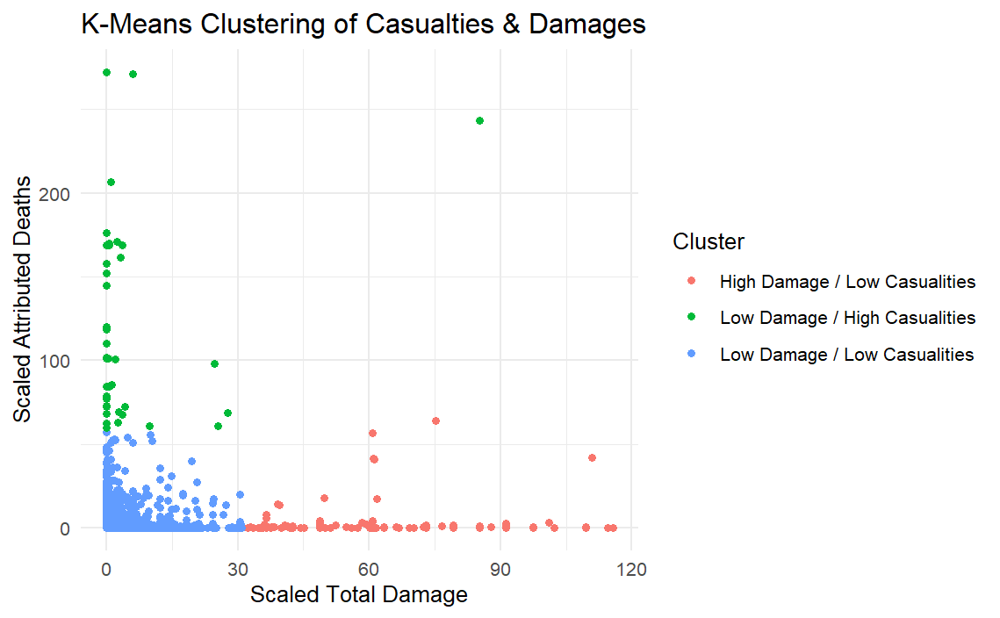

```{r, include=FALSE}
library(knitr)
library(xaringanExtra)
library(tidyverse)
xaringanExtra::use_panelset()
```
# Expanding on Damages
```{r echo=FALSE, out.width="90%", fig.align='center'}

```
---
# A Closer Look at Event Severity
### Using K-means Clustering
.panelset[
.panel[.panel-name[Visualisation]
```{r echo=FALSE, out.width="60%", fig.align='center'}

```
]
.panel[.panel-name[Table]
```{r, echo=FALSE, out.width="100%"}
cluster_data <- tibble(
  Cluster = c("High Damage / Low Casualities", "Low Damage / High Casualities", "Low Damage / Low Casualities"),
  `Total Events` = c(173, 43, 909757)
)

cluster_data <- cluster_data %>% 
  arrange(
    desc(`Total Events`)
  )

kable(cluster_data, caption = "Cluster Data Summary")
```
]
]