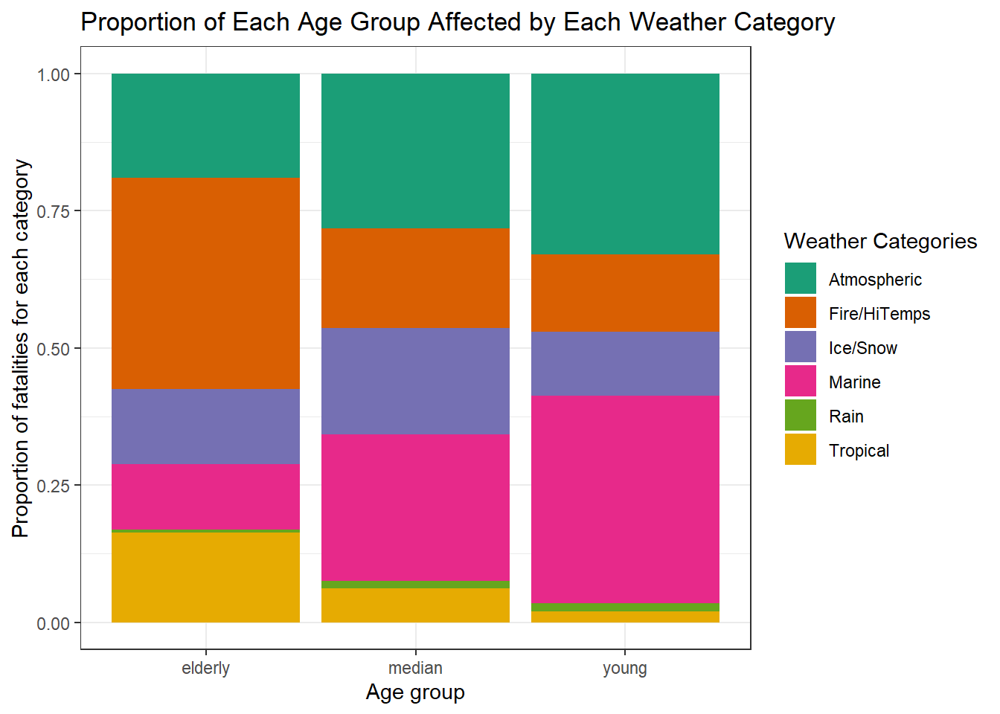

```{r packages, echo=FALSE, message=FALSE, warning=FALSE}
library(tidyverse)
xaringanExtra::use_panelset()
library(knitr)


```


```{r setup, include=FALSE}
# For better figure resolution
knitr::opts_chunk$set(fig.retina = 3, dpi = 300, fig.width = 6, fig.asp = 0.618, out.width = "80%")
```

# Dataset Background

## The Dataset
- Covers 1.6 million weather events in the United States and U.S. territories from 1996-2023.
- Collected by the National Oceanic & Atmospheric Administration (NOAA).
- Contains data on 50 variables regarding event details, and 8 variables regarding event fatalities


## What is a 'Storm Event'?
- According to the NOAA, storm events are 'weather phenomena having sufficient intensity to cause loss of life, injuries, significant property damage, and/or disruption to commerce.'
- Multiple storm events are grouped into storm episodes.

---
class: center, middle

# How have storm events changed over time, and what are the personal and monetary effects of these changes?

---
# Dataset Overview (Liv)

---
# Severity of Storms (Sarah)

---
# Geospatial Correlations (Adam)

---
# (Max)

---
# (Helen)

---
# What types of weather affect different age groups the most?

-Lets look at the distribution of ages in the fatalities in the United States.
--


.center[]
---

.panelset[
.panel[
.panel-name[Code]

```{r Proportion to age cat, eval= FALSE}

# plot of age groups and fatality type

ggplot(na.omit(combine_fatality), aes(x=age_group, fill=weather_cat)) +
  geom_bar(position = "fill") +
  scale_fill_brewer(palette = "Dark2") +
  labs(x= "Age group",
       y= "Proportion of fatalities for each category",
       fill= "Weather Categories",
       title = "Proportion of Each Age Group Affected by Each Weather Category") +
  theme_bw() 
# Proportion of each age group affected by
# different weather categories

```
]

.panel[
.panel-name[Plot]

.center[]

]
]

---
# Summary

---
# Questions?
