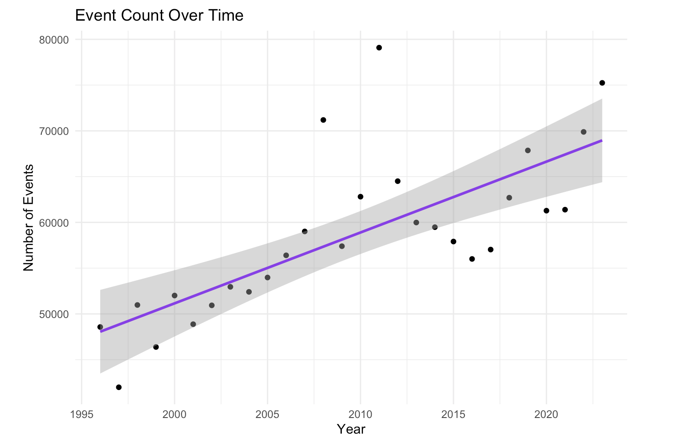
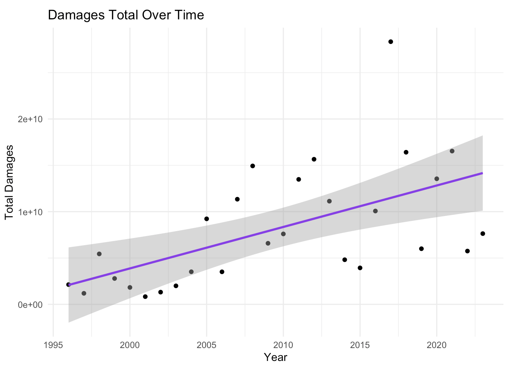
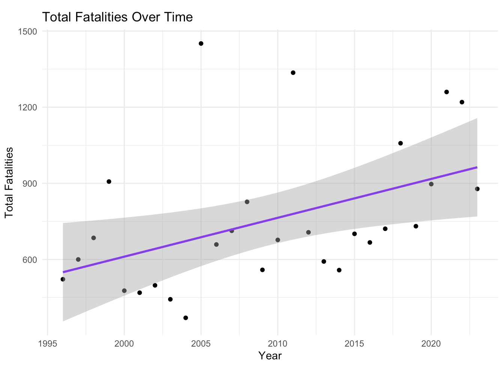
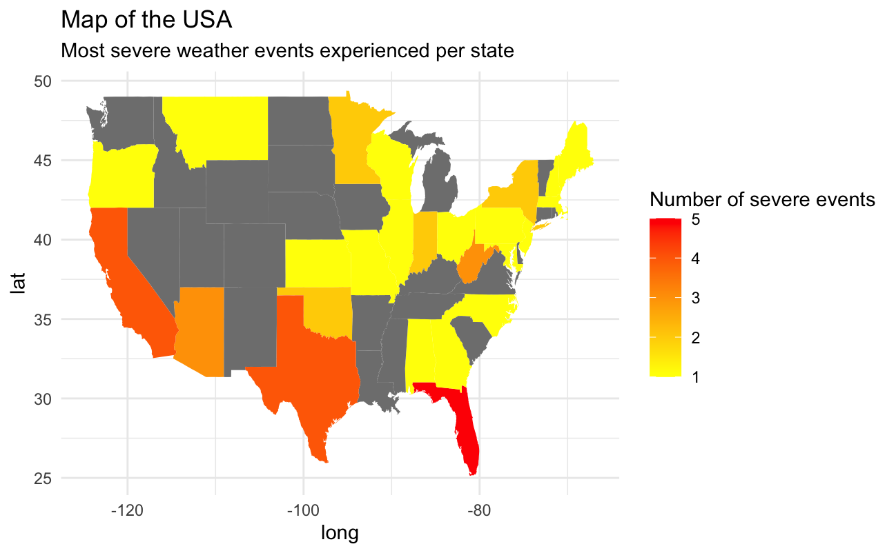
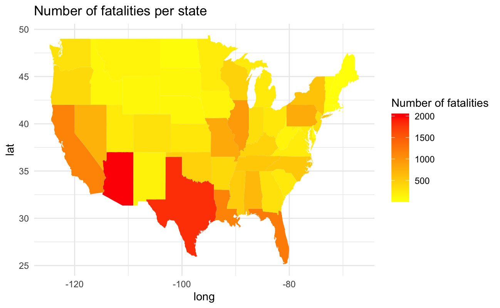
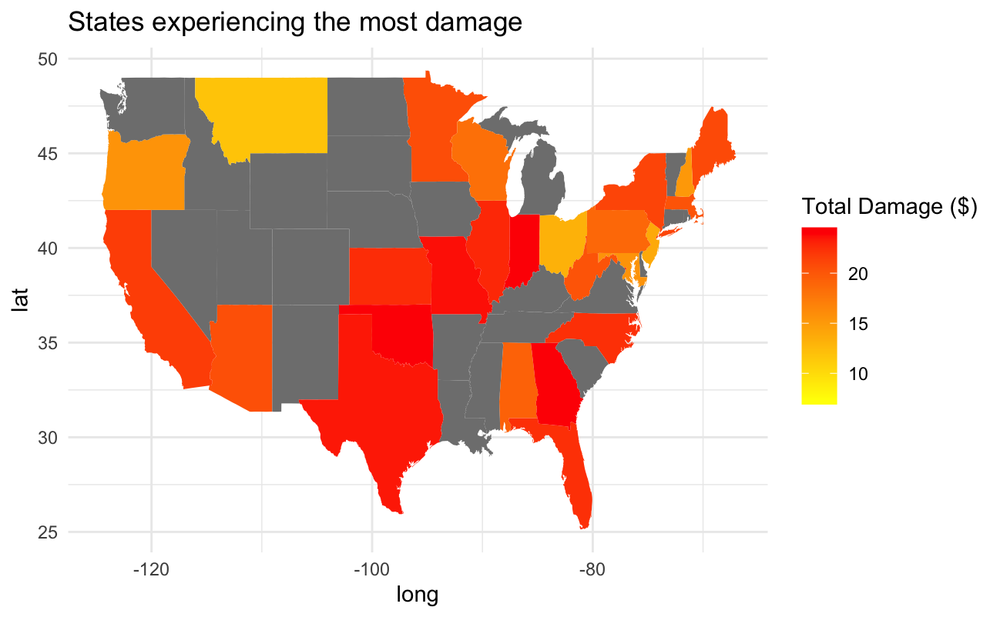
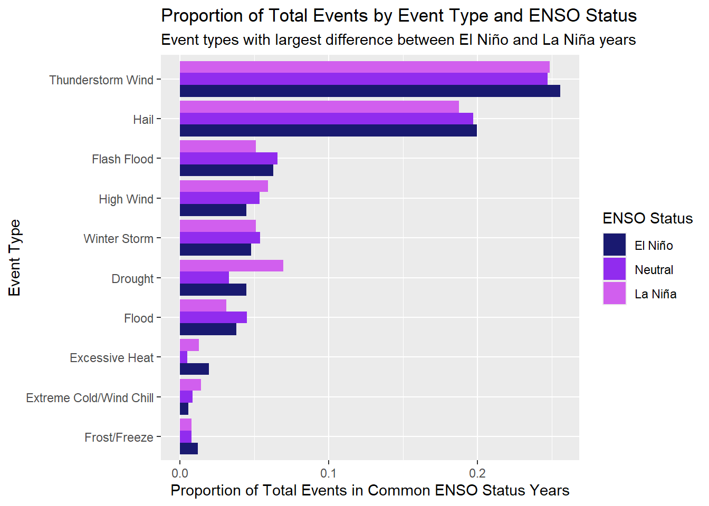

```{r load-packages, include = FALSE}
library(tidyverse)
xaringanExtra::use_panelset()
library(knitr)
library(xaringanExtra)
```


```{r xaringan-themer, include=FALSE, warning=FALSE}
library(xaringanthemer)
style_mono_accent(
  base_color = "#308068",
  header_font_google = google_font("Varela Round"),
  text_font_google   = google_font("Geist", "300", "300i"),
  code_font_google   = google_font("Fira Mono")
)
```

```{r setup, include=FALSE}
# For better figure resolution
knitr::opts_chunk$set(fig.retina = 3, dpi = 300, fig.width = 6, fig.asp = 0.618, out.width = "80%")
```


# Dataset Background

## The Dataset
- Covers 1.6 million weather events in the United States and U.S. territories from 1996-2023.
- Collected by the National Oceanic & Atmospheric Administration (NOAA).
- Contains data on 50 variables regarding event details, and 8 variables regarding event fatalities


## What is a 'Storm Event'?
- According to the NOAA, storm events are 'weather phenomena having sufficient intensity to cause loss of life, injuries, significant property damage, and/or disruption to commerce.'
- Multiple storm events are grouped into storm episodes.

---
class: center, middle

# How have storm events changed over time, and what are the personal and monetary effects of these changes?

---
### Are the number of storm events changing over time? 

.panelset[
.panel[
.panel-name[Code]

```{r Proportion to age cat2, eval= FALSE}

# Making variable year

details$year <- as.numeric(format(details$begin_dt, "%Y"))
events_per_year <- aggregate(event_id ~ year, data = details, FUN = length)
names(events_per_year) <- c("year", "event_count") 
model3 <- lm(event_count ~ year, data = events_per_year)

summary(model3)

# Visualising

ggplot(events_per_year, aes(x = year, y = event_count)) +
  geom_point() +  
  geom_smooth(method = "lm", se = TRUE, color = "purple2", linetype = "solid", size = 1) + 
  labs(title = "Event Count Over Time",
       x = "Year",
       y = "Number of Events") +
  theme_minimal()

```
]

.panel[
.panel-name[Plot]

.center[]

]
]

---

.panelset[
.panel[
.panel-name[Damages]
.center[]
]

.panel[
.panel-name[Fatalities]

.center[]

]
]

---
.panelset[
.panel[
.panel-name[Frequency] 
## Frequency of weather events across the US
.pull-left[]
.pull-right[]
]
.panel[
.panel-name[Fatalities]
##Number of fatalities across the US
.center[]
]
.panel[
.panel-name[Total Damage]
##Total damage caused by severe events
.center[]
]
]

---
# Expanding on Damages
```{r echo=FALSE, out.width="85%", fig.align='center'}
knitr::include_graphics("Damage by Event Type.jpg")
```
---
# A Closer Look at Event Severity
### Using K-means Clustering
.panelset[
.panel[.panel-name[Visualisation]
```{r echo=FALSE, out.width="57%", fig.align='center'}
knitr::include_graphics("Clustering.jpg")
```
]
.panel[.panel-name[Table]
```{r, echo=FALSE, out.width="100%"}
cluster_data <- tibble(
  Cluster = c("High Damage / Low Casualities", "Low Damage / High Casualities", "Low Damage / Low Casualities"),
  `Total Events` = c(173, 43, 909757)
)

cluster_data <- cluster_data %>% 
  arrange(
    desc(`Total Events`)
  )

kable(cluster_data, caption = "Cluster Data Summary")
```
]
]

---
# How Have Storms Changed?
#### Grouped by severity relative to fatality and damages averages
.panelset[
.panel[.panel-name[Total Averages]
<div class="row" style="display: flex; align-items: flex-start;">

<div class="column" style="flex: 1;">
```{r, echo=FALSE, out.width="100%", fig.align="right, top"}
knitr::include_graphics(c('Global Averages.png'))
```
</div> <div class="column" style="flex: 1; padding-left: 20px;">
<li>Event types were split into less/more damaging/deadly based on if their average total fatalities or damages exceeded or was short of the average for all events during the testing period.
<br>
<br>
<br>
<li>The substantial variance in between the less/more groups for each variable indicate a non-standard distribution of data, with events tending to be either highly severe, or rarely showing an impact.
</div> </div>
]

.panel[.panel-name[1996-7 Averages]
<div class="row" style="display: flex; align-items: flex-start;">

<div class="column" style="flex: 1;">
```{r, echo=FALSE, out.width="100%", fig.align="right, top"}
knitr::include_graphics(c('1996-7 Averages.png'))
```
</div> <div class="column" style="flex: 1; padding-left: 20px;">
<li>The fatalities average for all events over this period was 1.174728e-01
<li>The damages average was 1.713981e+06	
<br>
<br>
<br>
<li>It may be noted that numbers for both damages and fatalities - for both less/more groups - are greater than the total average across the data-set.
<br>
<br>
<br>
<li>This increase may be interpreted as this period having greater storm severity, or this period having a lack of storm-resilient infrastructure.
</div> </div>
]

.panel[.panel-name[2022-3 Averages]
<div class="row" style="display: flex; align-items: flex-start;">

<div class="column" style="flex: 1;">
```{r, echo=FALSE, out.width="100%", fig.align="right, top"}
knitr::include_graphics(c('2022-3 Averages.png'))
```
</div> <div class="column" style="flex: 1; padding-left: 20px;">
<li>The fatalities average for all events over this period was 1.162609e-01
<li>The damages average was 7.683527e+05	
<br>
<br>
<li>Comparing these results with those from the beginning of the dataset, 1996-7, we can calculate the percent changes in average fatalities (-1.031671%) and damages (-55.171452%).
<br>
<li>This is more drastic when looking at percent changes across groups:<br>
Percent change (less) fatalities: -33.33333%<br>
Percent change (more) fatalities: -48.59813%<br>
Percent change (less) damages: -87.89507%<br>
Percent change (more) damages: -6.966879%<br>
<br>
<li>Numbers went down across the board, making change in infrastructure over the years being an interesting future expansion to this project
</div> </div>
]
.panel[.panel-name[Code]
```{r fatality-graph-code, echo=TRUE, eval=FALSE, tidy=TRUE, highlight=TRUE, out.width="100%"}
#### Adjusted Graph for Fatalities (All Data)
fatality_graph <- details_grouped %>%
  ggplot(aes(x = fatality_group, 
             y = avg_fatalities_by_type, 
             fill = fatality_group)) +
  stat_summary(fun = "mean", geom = "bar", position = "dodge", alpha = 0.7) +
    geom_text(stat = "summary", fun = "mean", aes(label = round(after_stat(y), 2)), 
            vjust = -0.5, size = 3) +
  scale_fill_manual(values = c("More Deadly" = "red", "Less Deadly" = "green")) +
  labs(
    title = "Average Fatalities by Group",
    subtitle = "Based on Event Type Averages Compared to Global Average",
    x = "Weather Group",  
    y = "Average Fatalities per Event Type",
    fill = NULL
  ) +
  # There was some more theme and formatting, but there was no space
  )
```
]  
]
---
## Storm Events and ENSO
### Background: What is ENSO?
- Natural interannual climate event
- Image adapted from: https://iri.columbia.edu/our-expertise/climate/enso/enso-essentials/

```{r, echo=FALSE, out.width="25%", fig.align="right, top"}
knitr::include_graphics(c('el_nino.png', 'neutral.png', 'la_nina.png'))
```
### In the Eastern Pacific...

<div style="display: flex; justify-content: space-between; align-items: flex-end; height: 100px;">
  <div style="width: 45%; text-align: left;">
    <strong>El Niño:</strong>
    <ul>
      <li>Increased rainfall</li>
      <li>Warmer than normal</li>
      <li>Decreased oceanic productivity</li>
    </ul>
  </div>
  <div style="width: 45%; text-align: left;">
    <strong>La Niña:</strong>
    <ul>
      <li>Decreased rainfall</li>
      <li>Cooler than normal</li>
      <li>Increased oceanic productivity</li>
    </ul>
  </div>
</div>
---
### Can we see the impact of ENSO in our data?
```{r, echo = FALSE, out.width="auto", out.height = "520", fig.align="top"}

```
---
# What types of weather affect different age groups the most?

-Let's look at the distribution of ages in the fatalities in the United States.
--


.center[]
---

.panelset[
.panel[
.panel-name[Code]

```{r Proportion to age cat, eval= FALSE}

# plot of age groups and fatality type

ggplot(na.omit(combine_fatality), aes(x=age_group, fill=weather_cat)) +
  geom_bar(position = "fill") +
  scale_fill_brewer(palette = "Dark2") +
  labs(x= "Age group",
       y= "Proportion of fatalities for each category",
       fill= "Weather Categories",
       title = "Proportion of Each Age Group Affected by Each Weather Category") +
  theme_bw() 
# Proportion of each age group affected by
# different weather categories

```
]

.panel[
.panel-name[Plot]

.center[]

]
]

---
### What is happening to the elderly and youngest?

.panelset[
.panel[
.panel-name[Youngest Code]

```{r Bar of youngest, eval=FALSE}

# Young - Where is it affected?

young_category <- filter(young_fatality, 
                         weather_cat == "Marine" | 
                           weather_cat == "Atmospheric") %>%
ggplot(aes(x=event_type, fill=weather_cat)) +
  geom_bar() +
  scale_fill_brewer(palette = "Dark2") +
  labs(x ="Weather Event", 
       y ="Amount of Fatalities", 
       title="Young Fatalities by Most Popular Weather Categories", 
       fill="Weather Category") +
  theme_bw()+
  coord_flip() 

# young fatality age group plotted 
# with the 2 largest disproportionate 
# causes of fatalities

young_category

```

]

.panel[
.panel-name[Youngest Plot]

.center[]

]


.panel[
.panel-name[Elderly Code]

```{r Elderly plot code, eval=FALSE}

# Elderly - where is it affected?

# most affected by fire hi temps and tropical
# unlike the median category

elderly_category <- filter(elderly_fatality, 
                           weather_cat == "Fire/HiTemps" | 
                             weather_cat == "Tropical") %>%
ggplot(aes(x=event_type, fill=weather_cat)) +
  geom_bar() +
  scale_fill_brewer(palette = "Dark2") +
  labs(x ="Weather Event", 
       y ="Amount of Fatalities", 
       title="Elderly Fatalities by Most Popular Weather Categories", 
       fill="Weather Category") +
  theme_bw()+
  coord_flip() 

elderly_category

```

]

.panel[
.panel-name[Elderly Plot]

.center[]

]
]
---
### How has this changed over time?

.panelset[
.panel[
.panel-name[Proportion over time]

```{r Proportion over time bar plot, eval=FALSE}

# How has weather fatalities changed over time?

combine_facet <- ggplot(na.omit(combine_fatality), aes(x=age_group, fill=weather_cat)) +
  geom_bar(position = "fill") +
  scale_fill_brewer(palette = "Dark2") +
  labs(x= "Age group", y= "Proportion of fatalities for each category over time", 
       fill= "Weather Categories", 
       title = "Proportion of Each Age Group Affected by Each Weather Category") +
  scale_x_discrete(labels = c("elderly" = "E", "median" = "M", "young" = "Y"
  )) +
  theme_bw() +
  theme(axis.text.y = element_blank()) +
  facet_wrap(year(ymd)~.) 

# proportionality of weather categories 
# and fatality over years

combine_facet

```

]

.panel[
.panel-name[Plot]

.center[]

]

.panel[

.panel-name[Fire and High Temperatures]

```{r Fire and Hitemps, eval=FALSE}

# are Fire/HiTemps increasing?

combine_lines <- filter(combine_fatality, 
                        weather_cat == "Fire/HiTemps") %>%
  ggplot(aes(x=year(ymd), 
             colour=event_type)) +
  geom_line(aes(fill=..count..),
            stat="bin", binwidth = 1, linewidth = 1) +
  labs(x="Years",
       y="Amount of Fatalities",
       title="Amount of Fire and High Temperature Fatalities Over Time",
       colour="Event Types") +
  scale_colour_manual(values=c(
    "midnightblue", "purple2", "mediumorchid2"
    )) +
  theme_bw()

# plot looks at the changes of Fire/HiTemps weather_cat over years

combine_lines

```

]

.panel[
.panel-name[Plot]

.center[]

]

]

---
class: center, middle
# Questions?
